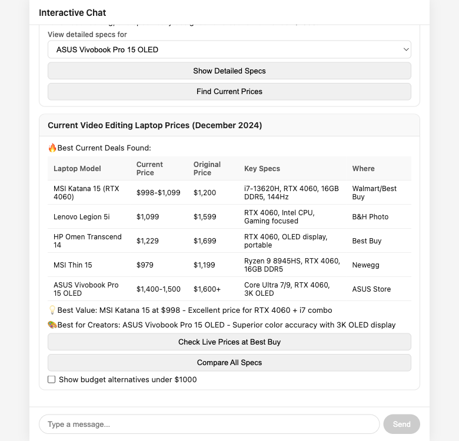
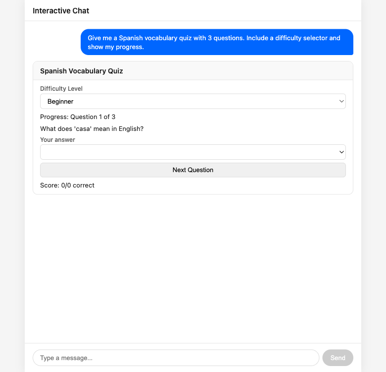
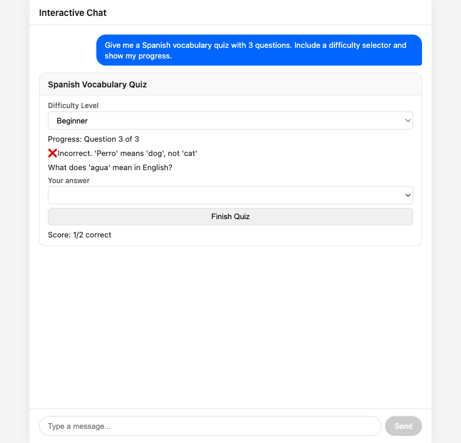
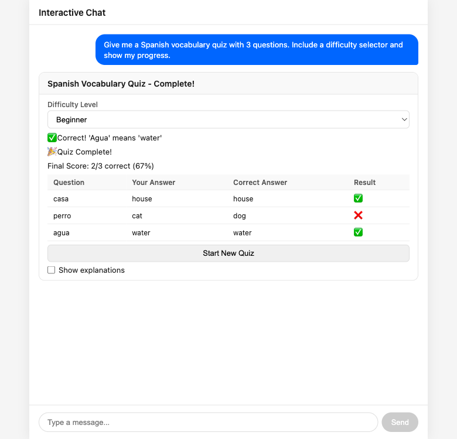
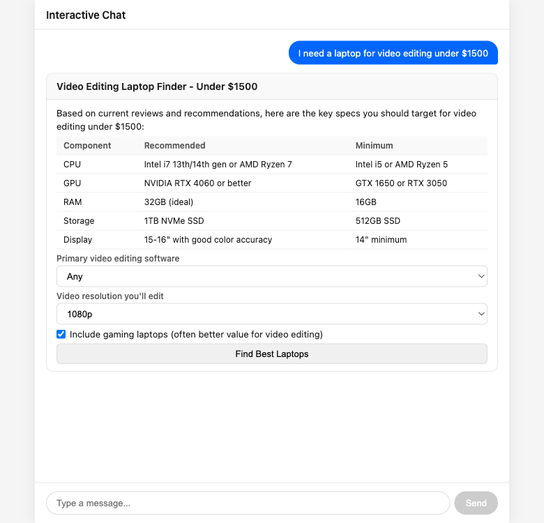
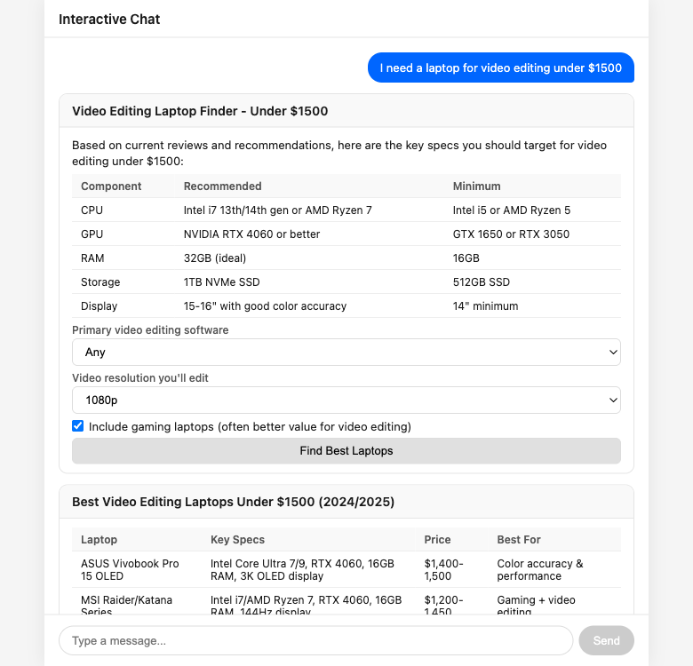
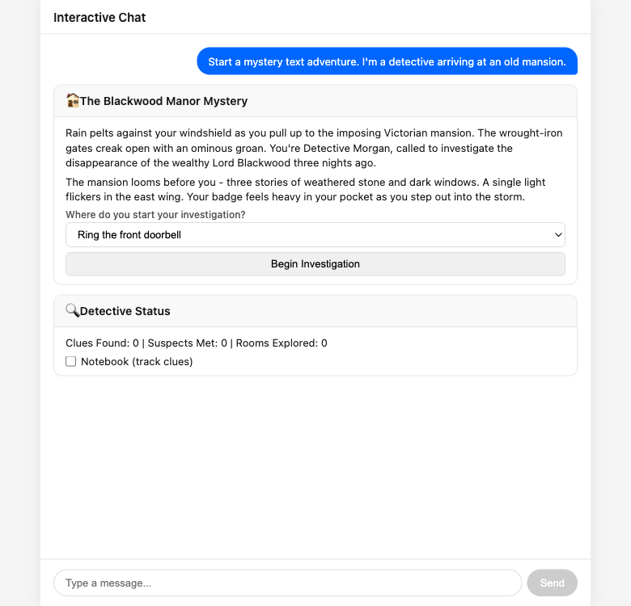
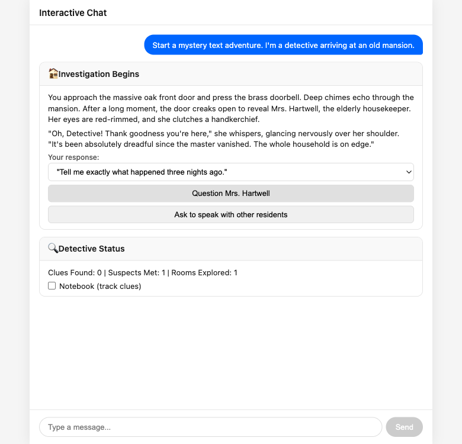
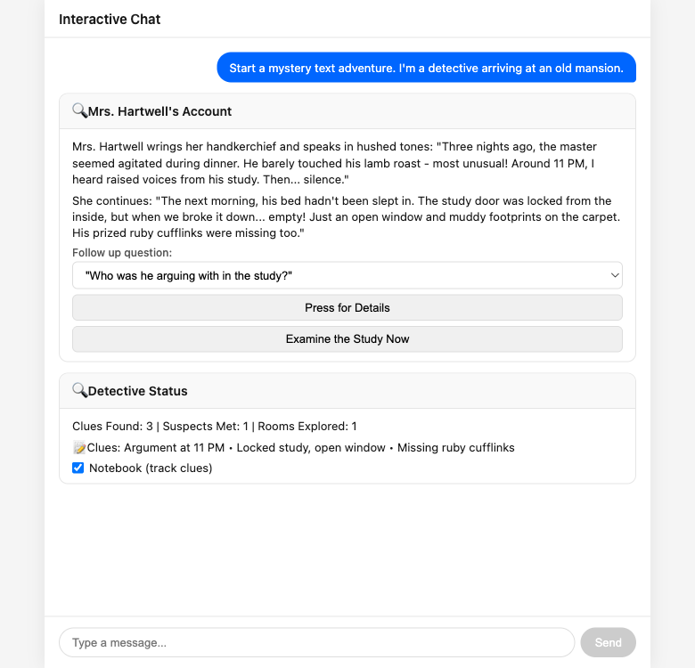

# Interactive Chat

> A chat interface where every LLM response is a live, interactive UI — not static text.

---

## The Problem

Traditional chat UIs render LLM responses as **plain text or markdown**.

- No way to interact with the response — can't sort, filter, select, or click
- If it shows a quiz, you can't click an answer
- If the LLM shows laptop options, you can't filter by price
- You describe everything in words, every time

Building custom UIs per use case (quizzes, comparisons, games) requires dedicated frontend dev — expensive for **throwaway interactions**.

---

## The Idea

The LLM returns **interactive UI** instead of text.

- Responds with structured JSON describing widgets — dropdowns, tables, buttons, sliders, cards
- Client renders them as real interactive components
- User interacts → goes back to the LLM → returns updated UI
- **The LLM is the logic layer. The client is a dumb renderer.**

```
User action → widget state → LLM (+ tool calls) → UI JSON → render → repeat
```

The JSON is a pure render format — no logic lives in the client or the JSON itself.

---

## How It Works

<div style="display: flex; align-items: center; justify-content: center; gap: 20px; margin-top: 2em; font-size: 0.9em;">
<div style="border: 2px solid #0066ff; border-radius: 12px; padding: 16px 20px; text-align: center; min-width: 130px;">
<strong>Frontend</strong><br>React renderer
</div>
<div style="display: flex; flex-direction: column; align-items: center; gap: 4px;">
<span>messages + state &rarr;</span>
<span>&larr; SSE widget JSON</span>
</div>
<div style="border: 2px solid #333; border-radius: 12px; padding: 16px 20px; text-align: center; min-width: 130px;">
<strong>Backend</strong><br>Hono + Node.js
</div>
<div style="display: flex; flex-direction: column; align-items: center; gap: 4px;">
<span>prompt + conversation &rarr;</span>
<span>&larr; UI JSON</span>
</div>
<div style="border: 2px solid #8b5cf6; border-radius: 12px; padding: 16px 20px; text-align: center; min-width: 130px;">
<strong>LLM</strong><br>Claude
</div>
<div style="display: flex; flex-direction: column; align-items: center; gap: 4px;">
<span>tool calls &rarr;</span>
<span>&larr; results</span>
</div>
<div style="border: 2px solid #16a34a; border-radius: 12px; padding: 16px 20px; text-align: center; min-width: 130px;">
<strong>Toolset</strong><br>Web Search
</div>
</div>

---

## Widget Types

The LLM composes UIs from 9 building blocks:

| Widget | Description |
|--------|-------------|
| **text** | Paragraphs — explanations, labels, feedback |
| **select** | Dropdown — difficulty selector, model picker, sort options |
| **table** | Data table — laptop specs, quiz results, price comparisons |
| **button** | Action trigger — "Submit", "Find Prices", "Begin Investigation" |
| **slider** | Range input — progress bars, budget controls |
| **toggle** | On/off switch — "Include gaming laptops", "Notebook (track clues)" |
| **text_input** | Text field — search queries, follow-up questions |
| **image** | Image display |
| **card** | Container with title + nested widgets |

These compose freely — a card can contain a table, dropdowns, and buttons.

---

## Feature: Streaming Responses

The backend streams LLM output as **Server-Sent Events**.

- Frontend progressively parses JSON chunks and renders widgets as they arrive
- User sees the UI building up in real time
- During tool execution, SSE events show tool status (e.g. "Using web_search...")
- Final `[DONE]` event signals the response is complete

---

## Feature: In-place Widget Updates

Every widget has a **unique ID** controlled by the LLM.

- Same ID → widget is **replaced in-place**
- New ID → widget is **appended**
- Widget interactions are **invisible** in the chat — no clutter

The LLM decides when to update vs. create.


---

## Feature: Tool Calls with Real Data

The LLM can **call external APIs** during a conversation.

- Tool call loop runs entirely on the backend — frontend shows "Using web_search..." status
- Tools defined via a modular **`Toolset` interface** — swap in different capabilities at startup
- Built-in: **Web Search** using Brave Search API for real-time pricing, reviews, and availability



---

## Feature: LLM as the Logic Layer

The client contains **zero application logic**.

- **Any use case works** without frontend changes — quiz, laptop finder, mystery game
- **Edge cases handled naturally** — the LLM adapts UI for empty results, errors, partial data
- **UI changes shape completely** between turns — form → table → confirmation card

---

## Demo: Spanish Vocabulary Quiz

3-question quiz with difficulty selector and score tracking.



---

## Demo: Quiz — Correct Answer

User selects "house" for 'casa' — score updates to 1/1, next question appears.


---

## Demo: Quiz — Wrong Answer

User selects "cat" for 'perro' — LLM explains the correct answer.



---

## Demo: Quiz — Final Results

Results table with all answers, correct answers, and final score (2/3, 67%).



---

## Demo: Laptop Finder (Web Search)

Product comparison powered by real-time web search.



---

## Demo: Laptop Finder — Recommendations

LLM generates a ranked table based on user preferences.



---

## Demo: Laptop Finder — Live Prices

Web search tool fetches current prices, availability, and deals.


**Demonstrates:** tool calls, web search, progressive disclosure, in-place updates.

---

## Demo: Mystery Text Adventure

An interactive story where the UI morphs every turn.



---

## Demo: Adventure — Inside the Mansion

Mrs. Hartwell answers the door. New dialogue, new choices, status tracker updates.



---

## Demo: Adventure — Gathering Clues

Questioning reveals clues. The detective's notebook fills in automatically.



**Demonstrates:** UI shape-shifting every turn, state tracking across interactions, zero frontend logic.

---

## Architecture

| Layer | Technology | Role |
|-------|-----------|------|
| **Frontend** | React 19 + Vite | Dumb renderer — renders JSON, captures interactions |
| **Backend** | Hono on Node.js | API server — conversation, system prompt, SSE streaming |
| **LLM** | Claude via `LLMProvider` | Logic layer — UI layout, tool calls, widget JSON |
| **Tools** | `Toolset` interface | External data — web search via Brave API. Swappable |
| **Testing** | Vitest + Playwright | Only the LLM layer is mocked — everything else is real |

**Extension points:** swap `LLMProvider` for a different model, swap `Toolset` for different capabilities. Frontend and backend don't change.

---

## What's Next

- **More toolsets** — Database queries, calendar, code execution
- **Richer widgets** — Charts, maps, code editors, file uploads
- **Persistent state** — Save and resume conversations
- **Multi-user** — Shared interactive sessions
